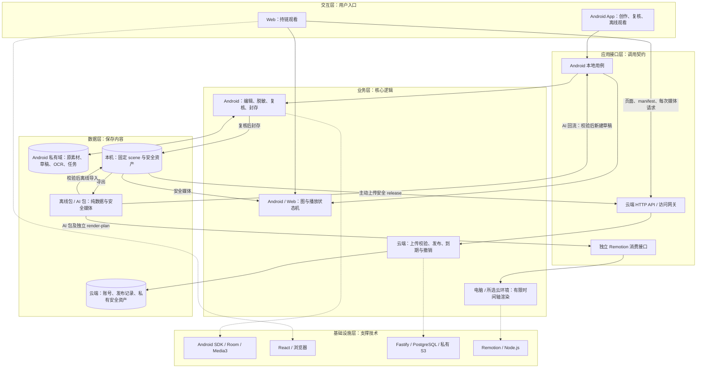

# 架构设计

[基础设施](#基础设施层) · [数据](#数据层) · [业务逻辑](#业务层) · [API / SDK](#应用接口层) · [页面](../README.md#页面与流转) · [任务与开发规则](tasks.md)

本文定义待实现的数据、接口和模块；具体版本组合与兼容范围在实现时验证。

当前 Android 壳层复用既有本地项目与媒体用例：顶层项目/演示库，项目工作区步骤/素材/检查，单步编辑器独立五模式；录制与候选、本地封存与离线观看已接入本机实现；托管交付与账号仍提供真实空态及禁用执行，不伪造后端状态。现有项目/素材持久化与安全输出边界不因换壳改变。

手动录制采用 MediaProjection + MediaRecorder 无声 H.264 Surface，点击链改用同一投影的 OES/FBO → MediaCodec/MediaMuxer 共帧管线，前台服务在获取投影前启动；点击链源观察与显式编码呈现分开，静态FBO重复呈现不新增观察或after，停止门禁冻结时间并用独立EOS标记保留尾长；每会话只消费一次授权和一次 virtual display，不持久化授权令牌。停止先断开采集，原始文件封口、同步后写 journal，再按稳定 sourceId 校验和登记私有素材；登记持久化未确认时保留 sealed 副本，重试幂等，中断不自动重新采集。仅当前会话的独占临时文件可显式删除。Workspace 局部更新在共享锁内读改写，原子替换后同步目录；“可能已提交”失败不删除原片。

API 32+ 利用系统等比 fit/居中输出固定编码画布，旋转和窗口变化可产生留边；API 34 记录内容尺寸回调及粗略 fit 区域，但时间不是媒体 PTS，不能用于触点映射。API 26–31 检测显示变化即结束本段。画面候选使用一个 Media3 Surface 会话，最多 361 次时间请求、30 个候选；32×32 特征比较并按实际帧 PTS 去重，毫秒精度。独立私有 SQLite 保存 source SHA、算法版本、检查点和人工选择；确认 PNG 保存为步骤后以稳定 captureId 对账，不把候选选择当复核。

授权只在点击开始时请求；前台通知可停止，通知权限拒绝仍可回 App 停止。基础手动录制使用 mediaProjection 前台服务及通知权限，没有音频、网络或广泛存储权限；预编排点击链另有下文的用户开启手势服务。画面可能含可见密码/键盘输入，不能承诺自动排除；尊重 FLAG_SECURE。预编排点击链增量使用用户主动开启的手势服务，窗口元数据仅作运行期守卫；点击链共帧证据使用独立私有侧车，消费 UI 待后续接入。官方约束参见 [MediaProjection 会话与尺寸变化](https://developer.android.com/media/grow/media-projection)、[前台服务类型](https://developer.android.com/develop/background-work/services/fgs/service-types#media-projection)、[受保护窗口](https://developer.android.com/reference/android/view/WindowManager.LayoutParams#FLAG_SECURE)。


离线 OCR 使用官方 PP-OCRv6_tiny ONNX 模型、官方 Maven ONNX Runtime 1.31.0 及 OpenCV 4.14.0 core/imgproc 源码；模型与字典随包、摘要固定，无运行时下载。受限 Bitmap RGB → 检测/裁切/识别/CTC 管线在单一后台任务运行，关闭 runtime 遥测并丢弃引擎日志。原始行/像素框按项目、源 SHA、实际帧时间/精度和模型版本保存在排除备份的私有 SQLite，不进入离线包。取消或切换保留已完成帧；删除项目/来源撤销在途写入并清除结果。标题只由用户显式采用且不覆盖已有文字，框仅供人工遮挡，遮挡后仍须重生成并复核实际输出。依赖与限额见 [原生实现](../tools/ocr-native/README.md)；主机合成图不代替 Android 性能或隐私覆盖验收。



箭头表示调用或数据流，虚线指向所用技术。原素材留在 Android 私有域；网页媒体始终经过访问网关。Remotion 在电脑或作者选择的云环境独立运行。

| 层级 | 职责 | 模块 | 技术 |
|---|---|---|---|
| 基础设施层 | 提供设备、运行环境、存储与调度 | Android、浏览器、托管服务、渲染环境 | Kotlin、Compose、Room、Media3、WorkManager；React、Vite；Node.js、Fastify、PostgreSQL、S3；Remotion |
| 数据层 | 定义存什么、怎么存、怎样关联 | 本机 11 张表、服务端 9 张表、版本化数据包 | SQLite / Room、PostgreSQL、私有文件、JSON Schema、SHA-256 |
| 业务层 | 执行编辑、脱敏、复核、播放、交付与发布规则 | Android 业务用例、`runtime-ts/`、`server/`、`remotion-adapter/` | 事务、固定快照、图校验、媒体编译、播放 reducer |
| 应用接口层 | 连接业务与调用方 | 本地用例、18 条 HTTP API、包消费接口、第三方库接入 | Kotlin 接口、HTTP / JSON、TypeScript 契约 |
| 交互层 | 提供创作和观看页面 | `android/`、`web-player/` | Compose 原生 App、React 观看网页 |

## 基础设施层

| 运行位置 | 模块 | 支撑能力 |
|---|---|---|
| Android 手机 | `android/` | Compose 页面；Room 私有持久化；系统媒体与 Media3 解码、脱敏、播放；WorkManager 调度可恢复任务 |
| 浏览器 | `web-player/` | React / Vite 观看页面；原生图片与 video；HTTP 网关读取安全资产 |
| 托管服务 | `server/` | TypeScript / Fastify 模块化单体；API 与校验 worker 共用代码；PostgreSQL 事务；私有 S3 兼容对象存储 |
| 共享契约与规则 | `contracts/`、`runtime-ts/` | schema、HTTP DTO、纯图校验和播放规则；Android 实现等价规则 |
| 电脑或所选云环境 | `remotion-adapter/` | 独立受信 React / Remotion 模板，消费 AI 数据包并输出视频 |

Android 初期按包分区，按实际需要拆 Gradle 模块。依赖版本、最低系统、编码配置、服务商与许可在接入时锁定；付费服务按确认后的方案开通。

## 数据层

### 存储约定

| 存储域 | 内容 | 类型与保护 |
|---|---|---|
| Android 私有域 | 原素材、原 OCR、活动草稿、候选、复核、任务、固定版本 | SQLite `TEXT` 存 UUID、枚举、SHA-256 十六进制串及 JSON；`INTEGER` 存整数和 0/1；`REAL` 存有限数 |
| 托管服务 | 账号、上传状态、主动发布的安全内容、分享与撤销 | PostgreSQL `uuid`、32 字节摘要 `bytea`、`timestamptz`、`jsonb`；对象始终私有 |
| 交付文件 | 版本化 scene、安全媒体、包清单；AI 包另有渲染计划 | UTF-8 JSON、固定字节资产、受控包内相对路径 |

本机 `*_at` 用 UTC epoch 毫秒；`*_pts_us` 使用解码返回的 presentation timestamp，避免按名义帧率推算。当前 FrameExtractor 仅返回毫秒，步骤另存 `time_precision_us=1000` 明示精度，不声称恢复原微秒。文件列只存受控私有目录相对路径。原素材、DB、原 OCR、预览缓存、撤销历史及凭据排除系统云备份和设备迁移。账号只恢复发布管理。本机原素材与草稿随设备保存。服务端 `owner_id` 从管理会话取得。

### 本机表

当前 Android 项目编辑增量以私有 SQLite 实现项目、步骤、来源引用、派生 PNG、热点和边的子集；复核后的图片复制、摘要核对与事务提交完成才进入步骤。文件复制前登记恢复记录，中断后按记录清理未提交文件，保留已提交资产。原素材工作台记录保持独立，项目媒体草稿按项目隔离；删除项目清理自己的派生图，原素材副本可从首页“本机保留素材”继续管理。观看包与封存使用独立私有目录；视频过渡以稳定 edge ID 绑定单独派生 MP4，SQLite v3 只增加过渡与恢复记录。源片引用计入过渡，换目标/删边清理旧绑定，普通重排保留；文件复制、完整解码及摘要核对后原子替换，提交前取消保留原绑定；提交后取消重新读取真实绑定与修订。固定候选另复制实际 MP4，整段观看确认绑定候选摘要及资产 hash；旧版本不随草稿修改。无视频沿用 schema 1，有视频使用 schema 2/video-viewer-2；Java 包边界必须提供全解码验证器，旧重载遇视频拒绝。完整撤销表尚未接入。

区域增量以 SQLite v4 增加 regions 和裁片恢复记录；保留 v1–v3 项目，不重建已有表。区域只依赖当前已复核安全底图的 ID、SHA 和尺寸；真实生成与人工复核分开。替换底图原子清除相关裁片/复核并保留失效定义，重新校正生成后复核。schema 3 / scene-regions-3 封存区域及 PNG，Java 与独立消费者都逐像素比对 bbox 裁片和底图；候选对真实裁片另行确认。

当前 SQLite v2 在 v1 基础上只新增 `next_actions`（作者编排），旧项目、资产、热点与边不重建。每个来源步骤最多一条下一步动作，`action_id`、标签、来源/目标步骤与项目绑定；目标删掉后置空并保留待修复动作，删除来源才级联移除。它没有画面矩形或点击证据；与热点边一起计入 80 条动作限额，终点不得有动作。显式顺序生成一次事务更新相邻动作并核对草稿修订，保留手动热点、未选步骤及末步原动作；普通分镜排序不重连。预览按动作读取真实安全图后记入访问历史。

SQLite v5 加法迁移新增 `editor_drafts`（项目/步骤复合主键、级联删除）和 `editor_draft_sessions`（项目会话 generation）。暂存只存版本化、≤256 KiB 的 base/edit/pendingForm 文字、动作和原始表单字符串；不含位图、来源路径、资产或过渡复核快照，不增加正式 revision。串行合并写入与保存/放弃共用锁，事件 generation 和持久化会话隔离旧回调；保存步骤与清除本步暂存同事务，放弃开始清行后的提交边界不可取消。加载项目先恢复全部暂存，再计算 dirty 门禁；无关字段三方合并，同字段冲突保留双方等待明确选择。媒体只从当前正式对象重新绑定；删除目标/项目与换图按正式图对账。应用面板、保存、复核仍是独立明确动作。

SQLite v6 将步骤的私有媒体依据明确分成 `videoFrame` 与 `image`，和成品里的 `recorded/authored/imported` 依据字段分开；不改变观看包 schema 或给 Remotion 传入私有来源。视频仍必须有真实 source + PTS/精度。安全图片只绑定当前项目、步骤、revision、正式资产 ID/SHA/尺寸；历史底图身份没有可读路径或文件外键，旧文件可清理。保存重新核对绑定，并逐像素确认新遮挡之外与该底图完全一致；旧烧入遮挡无法撤回。安全底图路径只接受已保存安全 PNG，不把外部截图误作安全底图；安全包回流另走 v8 独立来源契约。

截图增量使用 SQLite v7，受控重建仅 `states`，保留 v1–v6 的全部旧字段、关系、编辑草稿与恢复日志；保全核对或外键检查失败整次回滚。`origin_kind=image` 明确互斥为 `base_*` 的当前安全底图历史绑定，或 `image_source_id` 指向私有 `image_sources`；两者都不允许视频来源或 PTS。原截图先进入 `image-import-staging/{UUID}`，最终副本在独立 `image-sources/{UUID}`，从不登记为 `local_assets`。原图复制与派生 PNG 都有精确恢复记录；确认后来源、新项目（如需）和步骤同一事务登记。失败/取消不计配额，提交边界取消重读实存结果；无当前引用的原图以日志清理，封存资产独立保留。

静态 AI 回流使用 SQLite v8：`states` 新增独立 `packageImage` 来源分支与 nullable `package_import_id`，其 video/PTS/image_source/base 列全部为空、`evidence_kind=imported`。`package_step_origins` 保存包来源状态/资产/摘要与外部声明，通过项目/步骤/导入 ID 的延迟复合外键与步骤一一绑定；后续安全底图追加遮挡仍保留 imported 和私有来源沿革。仅受控重建 states，真实 v1–v7 数据、全部关系、文字草稿与恢复日志逐字段保全；失败原样回滚。

同项目单步复制复用 v8 表与资产恢复日志，无新迁移。`copySavedStep(projectId, stepId, expectedRevision, operationId)` 以稳定操作 ID 作为副本步骤 ID，复制并重新解码核对当前正式安全 PNG 后，将新步骤、出口与区域定义原子提交。源引用可共用，安全图片资产独立；安全底图绑定副本自身。包来源的本机 owner 与外部 source ID 明确分开，保留外包原始身份、摘要以及追加遮挡后的来源行。副本不继承视频过渡、裁片复核或编辑暂存，不改入边、起点和动画访问计划；修订更新使动画计划待核。

完整项目复制使用 SQLite v9 加法迁移，新增 `project_copy_operations` 与 `project_copy_files`。稳定操作身份、新项目预留、精确文件清单及工作台归属先落盘；独立安全 PNG/过渡/原截图/录屏副本同步后写新工作台 JSON，完整图、来源、动画计划与 committed 回执同事务提交。工作台锁先于项目锁，与录制登记保持一致；提交前重新核对全部图、计划与素材工作台。未提交工作台不出现在保留素材列表。回执不随源项目或副本删除，未确认结果不能重建；数据库提交未确定时保留所有文件，恢复只清明确日志归属的未提交副本。空项目同样登记工作台归属。

项目内所有已保存步骤、边、自环、起点、区域和本机来源都得到新身份与独立文件，包外部来源 ID/摘要保留，本机 owner 重映。原文件确实缺失时保留新来源记录及明确缺失结果，不能回退原片作为安全画面；已保存安全媒体缺失或摘要不符则整次失败。区域裁片保留但清人工复核；动画访问与效果（含失效引用）全部重映、标记待核对，不删参数。新项目无封存、发布、账号或分享 URI，继续走已有逐项成品复核流程。原项目暂存输入须先保存或放弃，不复制未提交草稿、撤销历史或 OCR 缓存。

`ai_import_sessions` 保存 preparing/ready/committed/cancelled/failed、预分配的新项目、精确输入 SHA、previewDigest 和完整预览记录。会话回执不随项目删除；同会话重复提交返回原结果，不重新建项目。原包复制到私有隔离区，严格完整校验后生成预览；提交重新解包比对同一 scene/plan，独立图片复制提前登记恢复日志，完整图/来源/区域/动画计划/提交回执在同一 SQLite 事务落盘。提交前失败只清本次副本；提交边界取消重读持久结果；恢复清理只针对精确会话与未登记资产，已建项目不回滚。

`draft_ai_configs` 独立保存 canvas、有限 visits、逐项稳定 ID 的 effects、绑定草稿修订与待修复状态。完整 scene.states 决定步骤，重复 visits 不增步。图/画面/区域变化标记待核对，坏引用和超时效果保留，不能静默删掉后导出；手机逐项表单核对修复；明确保存计划递增草稿修订，避免复用携带旧计划的候选。固定候选与草稿图片在同一项目锁内捕获计划，候选私有 draft-plan.json 绑定新 scene，正式封存后作为不可变计划读取，不写入 scene 或继承外部复核。

差异只对比用户明确选中的本机 local 不可变 release，显示“与所选版本比较”，并不证明其为原导出或作者身份。没有可核对版本时只展示待导入内容；现有最新 AI 配置可覆盖，不作为可信原导出计划快照，因此不虚构路径差异。静态包首增量不接受任何视频资产/边、裸 JSON、continue→结束、热点/边标签不一致、超编辑器限制的文字/不可逆 trim/不支持的边来源。所有问题逐项拒绝，不截断或强制改语义。完整 PNG 与裁片像素一致性、50 MiB、40 状态/80 边、区域 12/80、256 visits/effects 与 10 分钟限制沿用受信 codec。

选图仅系统 `OpenDocument` 返回的单个 content URI，不请求整库权限、不保留外部 URI。先限量复制 ≤10 MiB，按真实格式、CRC/完整像素流/完整 JPEG Huffman 扫描与 ≤12 MP、单边 ≤32768 校验；解析和解码前检查内存预算。API 26 的 BitmapFactory 仍须经独立完整性校验，不能把其部分位图当成功。EXIF 八方向先转正，输出短边 ≤1080、长边 ≤2400，再建立遮挡坐标。新 sRGB 像素面统一黑底压平透明并重新编码，输出只允许安全 PNG 块，EXIF/原 ICC/gainmap/缩略图/未知附加层与隐藏透明像素不外带。作者始终复核与保存相同的真实 PNG。

`evidence_kind` 与私有媒体来源分开：旧录屏步骤迁移为 `recorded`，作者补充截图为 `authored`；安全底图追加遮挡保留已有依据，未来外部成品回流才使用 `imported`。成品仍只输出已有 `sourceKind` 白名单值与已复核资产，不加入原图路径、摘要或编辑历史，不更改包 schema。


v1–v5 升级在 SQLiteOpenHelper `onConfigure`（事务外）关闭该连接池外键；升级事务先补齐旧加法表，再显式复制 states 到 v6 新表、删除旧表、改新表名及重建索引。步骤旧列及所有关系、区域、草稿、日志的带类型完整内容摘要须前后一致，再做外键和数据库完整性检查；未知额外触发器/视图或 states 索引拒绝迁移，失败连同版本号回滚。`onOpen` 恢复外键并核对成功才开放数据库。缺少原视频文件不删除来源记录或旧步骤。

每个项目有一份活动草稿，`projects` 同时承载项目与草稿信息。编辑事务递增 `draft_revision`；长任务使用固定输入快照。复制项目、脱敏包复制及 AI 回流创建新 `project_id`，保留来源对象 ID 用于差异比较。

#### projects：本地项目与活动草稿

| 字段 | 类型 | 必填 | 用途 |
|---|---|---|---|
| `project_id` | `TEXT` | 是 | 本地项目/活动草稿的主键 |
| `title` | `TEXT` | 是 | 显示标题 |
| `goal` | `TEXT` | 是 | 一句演示目标 |
| `created_at` | `INTEGER` | 是 | 创建时间 |
| `updated_at` | `INTEGER` | 是 | 最后修改时间 |
| `draft_revision` | `INTEGER` | 是 | 当前草稿版本，编辑事务递增；默认 1 |
| `start_state_id` | `TEXT` | 否 | 起点状态，可暂缺但不能交付 |
| `origin_release_id` | `TEXT` | 否 | 复制/回流所依据的版本标识 |
| `draft_config_json` | `TEXT` | 是 | 纳入子图、关键路径、AI 配置，结构见“本机 JSON 列” |
| `undo_json` | `TEXT` | 否 | 最近一次编辑的逆操作，结构见“本机 JSON 列” |

- PK：`project_id`。FK：`(project_id,start_state_id)` 延迟引用 `states`。索引：`updated_at`。
- 起点可暂缺，封存前补齐。`origin_release_id` 仅记录外部来源。保存状态由待提交编辑与 revision 计算。

#### sources：私有源素材

| 字段 | 类型 | 必填 | 用途 |
|---|---|---|---|
| `project_id` | `TEXT` | 是 | 所属本地项目 |
| `source_id` | `TEXT` | 是 | 私有源素材标识 |
| `kind` | `TEXT` | 是 | `video/image` |
| `private_relpath` | `TEXT` | 否 | 私有源副本路径；缺失时可空 |
| `display_name` | `TEXT` | 是 | 原文件名，只在本机显示 |
| `mime` | `TEXT` | 是 | 检测并允许的真实媒体类型 |
| `byte_length` | `INTEGER` | 是 | 文件实际字节数 |
| `sha256` | `TEXT` | 是 | 实际文件字节摘要 |
| `width` | `INTEGER` | 是 | 图像/视频内容宽度（像素） |
| `height` | `INTEGER` | 是 | 图像/视频内容高度（像素） |
| `rotation_deg` | `INTEGER` | 是 | 源素材旋转元数据 |
| `duration_ms` | `INTEGER` | 否 | 媒体时长毫秒；静态图为空 |
| `trim_start_ms` | `INTEGER` | 否 | 引用区间起点，包含 |
| `trim_end_ms` | `INTEGER` | 否 | 引用区间终点，不包含 |
| `analysis_json` | `TEXT` | 否 | 原 OCR 与候选结果，只在本机 |
| `imported_at` | `INTEGER` | 是 | 导入完成时间 |
| `availability` | `TEXT` | 是 | 是否还有可用源文件；`present/missing` |

- PK：`(project_id,source_id)`。FK：`project_id` → `projects`。
- 视频须有时长及有效裁剪区间；截图对应列为空。源文件缺失保留记录，重新取帧前须恢复来源。原文件名、原 OCR 留在本机。

#### states：画面状态

| 字段 | 类型 | 必填 | 用途 |
|---|---|---|---|
| `project_id` | `TEXT` | 是 | 所属本地项目 |
| `state_id` | `TEXT` | 是 | 画面状态的稳定标识 |
| `sort_order` | `INTEGER` | 是 | 显示顺序，不是身份 |
| `title` | `TEXT` | 是 | 显示标题 |
| `description` | `TEXT` | 是 | 步骤说明，纯文本 |
| `source_kind` | `TEXT` | 是 | 录制、作者编排、导入或待补录依据；`recorded/authored/imported/missing` |
| `source_id` | `TEXT` | 否 | 私有源素材标识 |
| `frame_pts_us` | `INTEGER` | 否 | 实际选中代表帧的源时间戳 |
| `input_asset_id` | `TEXT` | 否 | 从脱敏包导入时的安全底图 |
| `canvas_width` | `INTEGER` | 是 | 规范化内容画布宽度 |
| `canvas_height` | `INTEGER` | 是 | 规范化内容画布高度 |
| `is_terminal` | `INTEGER` | 是 | 是否明确结束状态；默认 0 |
| `confirmed_at` | `INTEGER` | 否 | 作者确认该对象/复核的时间 |
| `content_revision` | `INTEGER` | 是 | 本对象内容版本，用于关联失效 |

- PK：`(project_id,state_id)`。FK：项目；`(project_id,source_id)` → `sources`；`input_asset_id` → `local_assets`。索引：`(project_id,sort_order)`、`(project_id,source_id)`。
- 录制状态使用 source + PTS；作者截图使用 source；安全包导入使用 input_asset；待补录使用 `missing`。排序保留 ID。确认或素材变化更新 content_revision；依据、目标、热点坐标变化清空受影响对象的 confirmed_at。

#### hotspots：点击区域

| 字段 | 类型 | 必填 | 用途 |
|---|---|---|---|
| `project_id` | `TEXT` | 是 | 所属本地项目 |
| `hotspot_id` | `TEXT` | 是 | 热点标识；边可以只通过文字选择 |
| `state_id` | `TEXT` | 是 | 画面状态的稳定标识 |
| `label` | `TEXT` | 是 | 可读操作标签 |
| `x` | `REAL` | 是 | 归一化矩形左上角横坐标 |
| `y` | `REAL` | 是 | 归一化矩形左上角纵坐标 |
| `width` | `REAL` | 是 | 热点矩形归一化宽度 |
| `height` | `REAL` | 是 | 热点矩形归一化高度 |
| `confirmed_at` | `INTEGER` | 否 | 作者确认该对象/复核的时间 |
| `content_revision` | `INTEGER` | 是 | 本对象内容版本，用于关联失效 |

- PK：`(project_id,hotspot_id)`。FK 及索引：`(project_id,state_id)` → `states`。
- 矩形相对内容画布，范围 0–1、正面积且在画布内。对应动作从 `edges.hotspot_id` 查询。

#### edges：动作、分支与录制过渡

| 字段 | 类型 | 必填 | 用途 |
|---|---|---|---|
| `project_id` | `TEXT` | 是 | 所属本地项目 |
| `edge_id` | `TEXT` | 是 | 稳定动作/边标识 |
| `from_state_id` | `TEXT` | 是 | 源状态 |
| `to_state_id` | `TEXT` | 否 | 目标状态，与 end_label 二选一 |
| `end_label` | `TEXT` | 否 | 直接结束结果，与 to_state_id 二选一 |
| `hotspot_id` | `TEXT` | 否 | 热点标识；边可以只通过文字选择 |
| `label` | `TEXT` | 是 | 可读操作标签 |
| `trigger` | `TEXT` | 是 | 显式触发形式，无任意条件表达式；`tap/choice/continue` |
| `source_kind` | `TEXT` | 是 | 录制、作者编排、导入或待补录依据；`recorded/authored/imported` |
| `source_id` | `TEXT` | 否 | 私有源素材标识 |
| `source_start_pts_us` | `INTEGER` | 否 | 录制证据/过渡的真实起点 |
| `source_end_pts_us` | `INTEGER` | 否 | 录制证据/过渡的真实终点，不包含 |
| `transition_input_asset_id` | `TEXT` | 否 | 安全包中已存在的过渡资产 |
| `use_transition` | `INTEGER` | 是 | 是否播放绑定短视频；默认 0 |
| `confirmed_at` | `INTEGER` | 否 | 作者确认该对象/复核的时间 |
| `content_revision` | `INTEGER` | 是 | 本对象内容版本，用于关联失效 |

- PK：`(project_id,edge_id)`。FK：本项目 from/to state、hotspot、source；`transition_input_asset_id` → `local_assets`。索引：`(project_id,from_state_id)`、`(project_id,to_state_id)`、`(project_id,hotspot_id)`、`(project_id,source_id)`。
- to_state_id 与 end_label 恰有一个。hotspot 必须属于 from_state。同热点多结果打开选择面板。录制边保留证据区间，use_transition 仅决定是否播放该短片。

#### redactions：固定不透明遮挡

| 字段 | 类型 | 必填 | 用途 |
|---|---|---|---|
| `project_id` | `TEXT` | 是 | 所属本地项目 |
| `redaction_id` | `TEXT` | 是 | 一块固定遮挡的标识 |
| `state_id` | `TEXT` | 否 | 画面状态的稳定标识 |
| `edge_id` | `TEXT` | 否 | 稳定动作/边标识 |
| `x` | `REAL` | 是 | 归一化矩形左上角横坐标 |
| `y` | `REAL` | 是 | 归一化矩形左上角纵坐标 |
| `width` | `REAL` | 是 | 遮挡矩形的归一化宽度 |
| `height` | `REAL` | 是 | 遮挡矩形的归一化高度 |
| `color_argb` | `INTEGER` | 是 | 遮挡颜色，alpha 必须 255 |
| `content_revision` | `INTEGER` | 是 | 本对象内容版本，用于关联失效 |

- PK：`(project_id,redaction_id)`。FK：`(project_id,state_id)` → `states`；`(project_id,edge_id)` → `edges`；索引覆盖两个 FK。
- state_id、edge_id 恰有一个。每行一块固定遮挡；坐标相对目标内容画布，alpha 为 255。视频遮挡覆盖所选整段及敏感内容的完整运动范围。

#### regions：安全画面的可见区域

| 字段 | 类型 | 必填 | 用途 |
|---|---|---|---|
| `project_id` | `TEXT` | 是 | 所属本地项目 |
| `region_id` | `TEXT` | 是 | 可见区域标识 |
| `state_id` | `TEXT` | 是 | 画面状态的稳定标识 |
| `base_asset_id` | `TEXT` | 是 | 已经脱敏的底图 |
| `base_sha256` | `TEXT` | 是 | 区域所依赖底图的字节摘要 |
| `name` | `TEXT` | 是 | 区域名称，纯文本 |
| `group_name` | `TEXT` | 否 | 可选的区域分组 |
| `x_px` | `INTEGER` | 是 | 源安全底图中的像素左坐标 |
| `y_px` | `INTEGER` | 是 | 源安全底图中的像素上坐标 |
| `width_px` | `INTEGER` | 是 | 裁片像素宽度 |
| `height_px` | `INTEGER` | 是 | 裁片像素高度 |
| `source_width` | `INTEGER` | 是 | 安全底图真实宽度 |
| `source_height` | `INTEGER` | 是 | 安全底图真实高度 |
| `z_index` | `INTEGER` | 是 | 展示层级次序 |
| `anchor_x` | `REAL` | 是 | 裁片局部 0–1 横向锚点 |
| `anchor_y` | `REAL` | 是 | 裁片局部 0–1 纵向锚点 |
| `content_revision` | `INTEGER` | 是 | 本对象内容版本，用于关联失效 |

- PK：`(project_id,region_id)`。FK：本项目 state；`base_asset_id` → `local_assets`。索引：`(project_id,state_id)`。
- 类型固定 `screenshotCrop`。bbox 使用安全底图像素，anchor 使用裁片局部 0–1。底图摘要和实际尺寸须匹配；底图改变后重新生成区域。

#### local_assets：固定安全派生文件

| 字段 | 类型 | 必填 | 用途 |
|---|---|---|---|
| `asset_id` | `TEXT` | 是 | 安全派生资产标识 |
| `relative_path` | `TEXT` | 是 | 受控相对路径，不接受外链 |
| `role` | `TEXT` | 是 | 安全资产用途；`state_image/transition/thumbnail/cover/region_crop` |
| `mime` | `TEXT` | 是 | 检测并允许的真实媒体类型 |
| `byte_length` | `INTEGER` | 是 | 文件实际字节数 |
| `sha256` | `TEXT` | 是 | 实际文件字节摘要 |
| `width` | `INTEGER` | 是 | 图像/视频内容宽度（像素） |
| `height` | `INTEGER` | 是 | 图像/视频内容高度（像素） |
| `duration_ms` | `INTEGER` | 否 | 媒体时长毫秒；静态图为空 |
| `input_fingerprint` | `TEXT` | 是 | 输入与配置依赖指纹，不能替代输出摘要 |
| `created_at` | `INTEGER` | 是 | 创建时间 |
| `verified_at` | `INTEGER` | 是 | 实际文件重检成功时间 |

- PK：`asset_id`。唯一：`relative_path`。索引：`sha256`。
- 完整输出并重检后入表；临时文件留在任务工作区。每行对应固定字节，重新编码产生不同字节时创建新资产。input_fingerprint 仅判断依赖，实际输出使用 sha256。

#### reviews：实际输出的复核记录

| 字段 | 类型 | 必填 | 用途 |
|---|---|---|---|
| `review_id` | `TEXT` | 是 | 本机复核记录标识 |
| `project_id` | `TEXT` | 否 | 所属本地项目；独立成品导出复核可空 |
| `job_id` | `TEXT` | 是 | 固定快照任务标识 |
| `kind` | `TEXT` | 是 | `state/transition/graph/delivery` |
| `subject_id` | `TEXT` | 是 | 对应快照内的复核对象 |
| `input_fingerprint` | `TEXT` | 是 | 输入与配置依赖指纹，不能替代输出摘要 |
| `output_digest` | `TEXT` | 是 | 实际派生文件、文字及范围的组合摘要 |
| `policy_version` | `TEXT` | 是 | 使用的安全/容量政策版本 |
| `compiler_version` | `TEXT` | 是 | 生成派生资产的编译器版本 |
| `scope_json` | `TEXT` | 是 | 复核的实际资产、文字与图覆盖 |
| `confirmed_at` | `INTEGER` | 是 | 作者确认该对象/复核的时间 |
| `invalidated_at` | `INTEGER` | 否 | 已知失效时间；仍须实时比较摘要 |
| `invalidated_reason` | `TEXT` | 否 | 用于定位的失效原因 |

- PK：`review_id`。FK：可空 project；必填 job。索引：`(project_id,kind,subject_id)`、`job_id`。
- subject_id 按 kind 指向固定快照中的 state、edge、图或交付。output_digest 对按 assetId 排序的实际资产、textDigest、configDigest 和该 kind 的范围字段做规范化摘要；确认后范围固定。有效性实时比较依赖、实际输出及策略版本。

#### local_jobs：固定快照与可恢复任务

| 字段 | 类型 | 必填 | 用途 |
|---|---|---|---|
| `job_id` | `TEXT` | 是 | 固定快照任务标识 |
| `project_id` | `TEXT` | 否 | 所属本地项目 |
| `kind` | `TEXT` | 是 | `analyze/compile/export/upload/import` |
| `draft_revision` | `INTEGER` | 否 | 本任务绑定的草稿修订 |
| `release_id` | `TEXT` | 否 | 不可变成品版本标识 |
| `owner_account_id` | `TEXT` | 否 | 该上传任务绑定的账号，无凭据 |
| `input_fingerprint` | `TEXT` | 是 | 输入与配置依赖指纹，不能替代输出摘要 |
| `input_snapshot_json` | `TEXT` | 是 | 固定输入快照，不能读取正在变动的草稿代替 |
| `status` | `TEXT` | 是 | `queued/running/paused/waiting_review/succeeded/failed/cancelled` |
| `stage` | `TEXT` | 是 | 当前任务步骤 |
| `completed_units` | `INTEGER` | 是 | 已实际完成的资产/步骤数 |
| `total_units` | `INTEGER` | 否 | 已知的总单位数；未知时空 |
| `attempt` | `INTEGER` | 是 | 尝试次数 |
| `checkpoint_json` | `TEXT` | 是 | 已完成资产、临时文件和服务器回执 |
| `idempotency_key` | `TEXT` | 否 | 上传创建的稳定重试键 |
| `error_code` | `TEXT` | 否 | 机器可读失败原因 |
| `retryable` | `INTEGER` | 是 | 是否可在当前输入下重试 |
| `created_at` | `INTEGER` | 是 | 创建时间 |
| `updated_at` | `INTEGER` | 是 | 最后修改时间 |

- PK：`job_id`。FK：project。release_id 是输入或预分配输出标识，封存前仅作引用值。索引：`(status,updated_at)`、`(project_id,created_at)`；上传 idempotency_key 按账号唯一。
- stage 使用对应 kind 的阶段；completed_units 记录实际完成资产或步骤。恢复先检查鉴权、输入指纹和已完成文件。

#### local_releases：不可变版本与离线库

| 字段 | 类型 | 必填 | 用途 |
|---|---|---|---|
| `release_id` | `TEXT` | 是 | 不可变成品版本标识 |
| `project_id` | `TEXT` | 否 | 所属本地项目 |
| `source_draft_revision` | `INTEGER` | 否 | 成品所依据的本机草稿版本 |
| `origin` | `TEXT` | 是 | 本机生成或包导入；`local/imported` |
| `schema_version` | `TEXT` | 是 | 支持的交换格式版本 |
| `policy_version` | `TEXT` | 是 | 使用的安全/容量政策版本 |
| `content_digest` | `TEXT` | 是 | 规范化 scene 的摘要，含资产摘要 |
| `scene_json` | `TEXT` | 是 | 安全 Scene，结构见下方交付格式 |
| `asset_ids_json` | `TEXT` | 是 | 版本引用的完整安全资产 ID 清单 |
| `sealed_at` | `INTEGER` | 是 | 固定版本封存时间 |
| `last_opened_at` | `INTEGER` | 否 | 演示库最近打开时间，不属于成品内容 |
| `playback_checkpoint_json` | `TEXT` | 否 | 播放断点，不属于成品内容 |

- PK：`release_id`。FK：project，`ON DELETE SET NULL`。索引：`(project_id,sealed_at)`、`last_opened_at`。
- 仅保存已封存或已验证导入版本。内容、摘要、资产引用和标识只写一次；列表与播放断点可更新。导入同 ID 不同摘要返回冲突。

草稿对象通过项目内复合键关联。安全资源池 `local_assets` 可被复制项目共享；清理前扫描草稿、版本、任务及撤销快照的全部引用。删除节点在同一编辑事务处理关联，或保留 `missing` 位置供补录。删除整个项目按引用顺序处理；已独立保存的版本及托管分享继续存在。

| 任务 kind | stage |
|---|---|
| `analyze` | `inspect → extract → ocr → suggest` |
| `compile` | `snapshot → media → derived_assets → recheck → review → seal` |
| `export` | `assemble → verify → write` |
| `upload` | `create → transfer → commit` |
| `import` | `unpack → validate → install` |

### 本机 JSON 列

| JSON 列 | 结构与字段 |
|---|---|
| `projects.draft_config_json` | `{includedStateIds:[id], excludedStates:[{stateId,reason}], criticalPaths:[{pathId,edgeIds:[id]}], ai:{canvasPreset:"portrait1080"\|"landscape1080", fps:30, visits:[{visitId,stateId,selectedEdgeId:null\|id,holdFrames}], effects:[Effect]}}`；ai 可空。显示被排除节点，由作者明确排除。Effect 结构见下方交付格式。 |
| 单步内存撤销（当前实现） | `{projectId,stepId,revision,fields,pendingForm,textGroup}`；fields 复用编辑暂存白名单，仅标题/讲解/终点/热点/下一步，pendingForm 为原始面板输入。不写数据库、不持有媒体、路径、裁片或复核。每次撤销重读正式修订后恢复当前草稿，并走原自动暂存；只消费一次。成功保存、放弃、打开/取消面板、离步、重开或正式修订变化清空。 |
| `projects.undo_json`（后续设计，未落库） | 通用编辑事务回退尚未实现；未来需精确绑定修订、白名单行与媒体引用生命周期，不能绕过隐私失效规则。 |
| `sources.analysis_json` | `{engine,modelVersion,samples:[{ptsUs,changeScore,blocks:[{text,bboxPx:{x,y,width,height},confidence:null\|number}]}], suggestions:[{kind:"state"\|"hotspot"\|"merge", sourcePtsUs, otherStateId:null\|id, rect:null\|{x,y,width,height}, label}]}`。仅分析采样点，不存整片每帧；原 OCR、原建议留本地。候选写入编辑对象后仍须人工确认。 |
| `reviews.scope_json` | 通用 `{assets:[{assetId,sha256,byteLength}],textDigest,configDigest}`；state 包含底图/缩略图/区域与对应文案；transition 另有 `{durationMs,fullClipReviewed:true,audioTracks:0}`；graph 另有 `{graphDigest,visitedEdgeIds:[id],completedCriticalPathIds:[id]}`；delivery 另有 `{sceneDigest,packageFileListDigest,coverAssetId:null\|id}`。这些是本机确认记录，仅由本机复核产生。 |
| `local_jobs.input_snapshot_json` | 编译/分析：`{project:{projectId,revision,title,goal,startStateId,config},sources:[SourceRow（不复制 analysis_json）],states:[StateRow],edges:[EdgeRow],hotspots:[HotspotRow],redactions:[RedactionRow],regions:[RegionRow]}`，Row 对应各字段表；导出/上传：`{releaseId,contentDigest,exportKind,renderConfig,expiryDays,serverProjectId}`（只保留该任务需要的字段）；导入：`{inputRelativePath,inputSha256,importAs:"library"\|"draft"}`。 |
| `local_jobs.checkpoint_json` | `{completedAssets:[{assetId,sha256}],tempFiles:[relativePath],candidateReleaseId:null\|id,sceneDigest:null\|hash,uploadId:null\|id,receivedAssetIds:[id],serverReceipt:null\|{publicationId,releaseId,shareUrl,expiresAt},outputFile:null\|{relativePath,sha256,byteLength}}`。账号 token 不进此列；shareUrl 在私有 DB 内保护且不写日志。 |
| `local_releases.asset_ids_json` | `[assetId]`，必须与 scene 资产清单一一对应；引用只能指向完整 `local_assets`。Room 无法给 JSON 元素加 FK，由封存/导入事务及清理前引用扫描保证。 |
| `local_releases.playback_checkpoint_json` | `{contentDigest,currentStateId,visits:[{stateId,selectedEdgeId:null\|id}],phase:"ready"\|"ended"}`。不持久化半段视频播放回调；恢复从明确状态开始。在线恢复先重验 share，不能仅凭断点继续取媒体。 |

### 服务端表

服务端存账号、上传及安全发布数据。scene_json 使用下方交付 Scene；资产索引列与 scene.assets 保持一致。

#### accounts：发布管理账号

| 字段 | 类型 | 必填 | 用途 |
|---|---|---|---|
| `account_id` | `uuid` | 是 | 发布管理账号标识 |
| `email` | `text` | 是 | 账号邮箱，仅用于账号服务 |
| `email_normalized` | `text` | 是 | 按约定规则规范化的邮箱 |
| `created_at` | `timestamptz` | 是 | 创建时间 |
| `disabled_at` | `timestamptz` | 否 | 账号禁用时间，空表示未禁用 |

- PK：`account_id`。唯一：`email_normalized`。
- 邮箱按固定规则规范化，保留点号和 + 别名差异；仅用于账号服务。

#### auth_challenges：一次性验证码

| 字段 | 类型 | 必填 | 用途 |
|---|---|---|---|
| `challenge_id` | `uuid` | 是 | 一次邮箱验证码挑战标识 |
| `email_normalized` | `text` | 是 | 按约定规则规范化的邮箱 |
| `code_mac` | `bytea` | 是 | 服务端密钥和挑战上下文生成的验证码摘要 |
| `attempt_count` | `smallint` | 是 | 已尝试验证码次数 |
| `max_attempts` | `smallint` | 是 | 本挑战允许的尝试上限 |
| `expires_at` | `timestamptz` | 是 | 绝对到期时间，服务器判定 |
| `consumed_at` | `timestamptz` | 否 | 验证码成功消费时间 |
| `created_at` | `timestamptz` | 是 | 创建时间 |

- PK：`challenge_id`。索引：`(email_normalized,created_at)`、`expires_at`。
- code_mac 使用服务器密钥与 challenge 上下文。验证时锁行、限制尝试并一次消费；到期和限速参数由服务配置返回。

#### sessions：可撤销管理会话

| 字段 | 类型 | 必填 | 用途 |
|---|---|---|---|
| `session_id` | `uuid` | 是 | 管理会话标识 |
| `account_id` | `uuid` | 是 | 发布管理账号标识 |
| `token_hash` | `bytea` | 是 | 查找/验证 bearer token 的摘要 |
| `created_at` | `timestamptz` | 是 | 创建时间 |
| `expires_at` | `timestamptz` | 是 | 绝对到期时间，服务器判定 |
| `revoked_at` | `timestamptz` | 否 | 首次撤销生效时间，不能恢复为空 |

- PK：`session_id`。FK：`account_id` → `accounts`。唯一：`token_hash`。索引：`account_id`、`expires_at`。
- bearer 会话可到期、可撤销；到期后重新验证码登录。

#### hosted_projects：本人托管项目归组

| 字段 | 类型 | 必填 | 用途 |
|---|---|---|---|
| `project_id` | `uuid` | 是 | 服务端项目主键，即 API serverProjectId |
| `owner_id` | `uuid` | 是 | 由管理会话确定的账号 |
| `client_project_id` | `uuid` | 是 | 本机 project_id，仅用于归组映射 |
| `title` | `text` | 是 | 显示标题 |
| `next_version` | `integer` | 是 | 下一次服务器发布序号；默认 1 |
| `created_at` | `timestamptz` | 是 | 创建时间 |

- PK：`project_id`。FK：`owner_id` → `accounts`。唯一：`(owner_id,client_project_id)`、`(project_id,owner_id)`。
- 用于发布归组；异机通过 owner 列表管理已发布内容。next_version 在发布事务中递增。

#### publication_uploads：上传、配额预留与校验

| 字段 | 类型 | 必填 | 用途 |
|---|---|---|---|
| `upload_id` | `uuid` | 是 | 本次安全资产上传/校验标识 |
| `project_id` | `uuid` | 是 | 所属托管项目 |
| `owner_id` | `uuid` | 是 | 由管理会话确定的账号 |
| `release_id` | `uuid` | 是 | 不可变成品版本标识 |
| `scene_json` | `jsonb` | 是 | 安全 Scene，结构见下方交付格式 |
| `content_digest` | `bytea` | 是 | 规范化 scene 的摘要，含资产摘要 |
| `expiry_days` | `smallint` | 是 | 1、7、30 天之一 |
| `state` | `text` | 是 | `receiving/validating/committed/cancelled/rejected/expired` |
| `idempotency_key` | `uuid` | 是 | 上传创建的稳定重试键 |
| `request_digest` | `bytea` | 是 | 创建请求摘要，防同键换请求 |
| `commit_key` | `uuid` | 否 | commit 独立幂等键 |
| `commit_request_digest` | `bytea` | 否 | commit 请求摘要 |
| `reserved_until` | `timestamptz` | 是 | 上传截止与额度预留到期时间 |
| `created_at` | `timestamptz` | 是 | 创建时间 |
| `commit_requested_at` | `timestamptz` | 否 | 已接受发布意图的时间 |
| `committed_at` | `timestamptz` | 否 | 正式发布事务完成时间 |
| `lease_token` | `uuid` | 否 | worker 当前租约身份 |
| `lease_until` | `timestamptz` | 否 | worker 租约有效期 |
| `attempt` | `integer` | 是 | 尝试次数 |
| `next_attempt_at` | `timestamptz` | 否 | 恢复/重试调度时间 |
| `error_code` | `text` | 否 | 机器可读失败原因 |

- PK：`upload_id`。复合 FK：`(project_id,owner_id)` → `hosted_projects`。唯一：`(owner_id,idempotency_key)`。
- 部分唯一索引：`(owner_id,release_id) WHERE state IN ('receiving','validating')`。其他索引：`(project_id,state,reserved_until)`、`(state,next_attempt_at,lease_until)`。
- 项目行锁下先关闭过期预留再创建；expiry_days 为 1/7/30。校验 worker 的租约、尝试和恢复状态保存在本行。

#### publication_assets：每次上传的安全资产

| 字段 | 类型 | 必填 | 用途 |
|---|---|---|---|
| `upload_id` | `uuid` | 是 | 本次安全资产上传/校验标识 |
| `asset_id` | `uuid` | 是 | 安全派生资产标识 |
| `relative_path` | `text` | 是 | 受控相对路径，不接受外链 |
| `role` | `text` | 是 | 安全资产用途 |
| `mime` | `text` | 是 | 检测并允许的真实媒体类型 |
| `byte_length` | `bigint` | 是 | 文件实际字节数 |
| `sha256` | `bytea` | 是 | 实际文件字节摘要 |
| `width` | `integer` | 是 | 图像/视频内容宽度（像素） |
| `height` | `integer` | 是 | 图像/视频内容高度（像素） |
| `duration_ms` | `integer` | 否 | 媒体时长毫秒；静态图为空 |
| `staging_key` | `text` | 否 | 私有暂存对象 key，不对外暴露 |
| `final_key` | `text` | 否 | 固定成品对象 key，不对外暴露 |
| `state` | `text` | 是 | `declared/received/verified` |
| `received_at` | `timestamptz` | 否 | 实际字节接收完成时间 |
| `verified_at` | `timestamptz` | 否 | 实际文件重检成功时间 |

- PK：`(upload_id,asset_id)`。FK：upload_id → `publication_uploads`。唯一：`(upload_id,relative_path)`、非空 `final_key`。
- 声明取自 scene.assets，实际字节须匹配。release 经 upload_id 定位整组资产。commit 后行和对象固定；存储 key 仅供服务端使用。

#### releases：服务端不可变版本

| 字段 | 类型 | 必填 | 用途 |
|---|---|---|---|
| `release_id` | `uuid` | 是 | 不可变成品版本标识 |
| `project_id` | `uuid` | 是 | 所属托管项目 |
| `owner_id` | `uuid` | 是 | 由管理会话确定的账号 |
| `upload_id` | `uuid` | 是 | 本次安全资产上传/校验标识 |
| `version_ordinal` | `integer` | 是 | 同托管项目的服务端显示序号 |
| `schema_version` | `text` | 是 | 支持的交换格式版本 |
| `policy_version` | `text` | 是 | 使用的安全/容量政策版本 |
| `scene_json` | `jsonb` | 是 | 安全 Scene，结构见下方交付格式 |
| `content_digest` | `bytea` | 是 | 规范化 scene 的摘要，含资产摘要 |
| `created_at` | `timestamptz` | 是 | 创建时间 |

- PK：`release_id`。FK：upload_id → `publication_uploads`；`(project_id,owner_id)` → `hosted_projects`。唯一：upload_id、`(project_id,version_ordinal)`。
- 发布成功事务插入，内容列只写一次。同 ID 不同摘要返回冲突。

#### shares：观看链接、到期与撤销

| 字段 | 类型 | 必填 | 用途 |
|---|---|---|---|
| `share_id` | `uuid` | 是 | 分享/Publication 标识 |
| `release_id` | `uuid` | 是 | 不可变成品版本标识 |
| `token_hash` | `bytea` | 是 | 查找/验证 bearer token 的摘要 |
| `token_ciphertext` | `bytea` | 是 | 供本人重取链接的加密 token |
| `token_key_version` | `text` | 是 | 解密所用密钥版本 |
| `created_at` | `timestamptz` | 是 | 创建时间 |
| `expires_at` | `timestamptz` | 是 | commit 时间加 expiry_days，创建后不延期 |
| `revoked_at` | `timestamptz` | 否 | 首次撤销生效时间，不能恢复为空 |

- PK：`share_id`。FK：release_id → `releases`。唯一：release_id、token_hash。索引：expires_at。
- 一个 release 对应一条分享。状态由 revoked_at 和服务器时间推导为 active / revoked / expired。到期时间在 commit 时固定。加密 token 供本人异机重取链接；解密密钥存于数据库外。

#### share_revocations：持久撤销事实

| 字段 | 类型 | 必填 | 用途 |
|---|---|---|---|
| `sequence` | `bigint` | 是 | 追加式撤销记录序号；自增 |
| `share_id` | `uuid` | 是 | 分享/Publication 标识 |
| `revoked_at` | `timestamptz` | 是 | 首次撤销生效时间，不能恢复为空 |

- PK：`sequence`。唯一：share_id。shares 撤销事务同时追加本表。
- 撤销事实独立保留，业务行删除保留该记录。灾备使用独立 WAL / 撤销归档及恢复水位；无法证明水位完整时，旧链接保持禁用。

### 版本化交付格式

Android 静态包固定 `schemaVersion=1`、`policyVersion=static-viewer-1`、`compilerVersion=tapscene-android-1`：PNG 图片、文字、单热点单 tap 边和每状态至多一个作者确认的 continue 按钮；静态包不支持视频边/区域/AI。视频包另用 schema 2 / video-viewer-2，加入边绑定的无声 AVC 8 位 4:2:0 过渡；实际 SPS 限 Baseline/Main/Extended/High，逐样本检查新 SPS 并完整解码。缺省或无法识别的色彩标签按 SDR 默认解释，明确 PQ/HLG 拒绝；此限制不用于普通录屏导入及其 HDR 规范化路径。continue 仅在观看者点击时执行。全部状态须从起点可达且可到达某个结束；显式回访允许，但无出口分量拒绝。

`release-store` 私有目录将候选、封存版本、隔离暂存和导出缓存分开。固定修订复制与草稿删除共用项目锁；候选复核绑定规范化 scene、实际图片摘要及文件清单，全部边实际覆盖和一次从起点到结束的历史才可封存。图/文字改变另生成候选；旧候选可明确按旧修订封存。完整内容原子登记后才可见，删除项目不删除独立成品；观看包导入只加入观看库；静态 AI 回流另走隔离会话创建独立草稿，两者均不信任外部复核声明。

静态 profile 限额：40 状态、80 边、每状态 6 热点、40 PNG + 2 JSON；ZIP 及解压总量各 50 MiB，scene ≤512 KiB、manifest ≤64 KiB。JSON 拒绝重复键/未知字段，深度 ≤16、节点 ≤8192、单字符串 ≤8192、总 UTF-16 字符 ≤262144；坐标使用 0–1、最多六位普通小数，其余数字为安全整数，规范化仅覆盖该受限数字域。PNG 为 8 位 RGB/RGBA 非交错，短边 ≤1080、长边 ≤2400，仅允许现有安全颜色块和像素块；实际重解码检查不透明。ZIP 接受 stored/deflate，拒绝重复/穿越/链接/加密/ZIP64/多盘/额外字段或注释/未声明文件；大于 1 MiB 的条目膨胀比不得超过 200。播放器与主机检查共用纯数据状态机，平台画面验证成功后才推进历史/覆盖。

`releaseId + contentDigest` 标识固定 scene 及资产。contentDigest 为 SHA-256（[RFC 8785 JCS](https://www.rfc-editor.org/rfc/rfc8785) 规范化 scene 的 UTF-8 字节）。scene 包含全部资产摘要，contentDigest 本身存于外层。图摘要同样按明确字段的规范化结构计算。

| 文件 | 内容与关系 |
|---|---|
| `manifest.json` | `{schemaVersion,exportKind:"viewer"\|"ai",releaseId,contentDigest,files:[{path,byteLength,sha256}]}`；files 枚举除 manifest 自身外的全部文件 |
| `scene.json` | 不可变版本内容；观看包与 AI 包共用。必有全部被引用的安全媒体 |
| `render-plan.json` | AI 包独立渲染配置；与 scene 的 releaseId、contentDigest 绑定 |
| AI 包说明文件 | schema 与 README，解释数据结构和消费方式；执行模板单独分发 |

当前 AI 导出已实现 `tapscene-remotion-1` / `TapSceneDemo`：完整固定 scene 原样复用，配置保存在独立目录，导出为 `.tapscene-ai`。受信消费者及依赖单独在 `remotion-adapter/`。固定 30 fps、256 visits、256 effects、单次 hold 1–1800 帧、总长 ≤18000 帧、计划 ≤256 KiB；region 总量 80/每步 12、资产总量 200。包内 schema 仅说明，不授权执行；消费者使用内置严格结构和语义规则。包可另算 packageDigest。只调整有限路径、画布、停留或效果时保留原 release，生成新的 AI 包并复核最终 render-plan / 文件清单。修改图、文案、区域底图或媒体时重新封存 release。

| 对象 | 字段 |
|---|---|
| `scene` | `schemaVersion, policyVersion, compilerVersion, releaseId, title, goal, createdAt, startStateId, states[], edges[], hotspots[], regions[], assets[]`；regions 可以空。 |
| `states[]` | `{id,imageAssetId,width,height,title,description,sourceKind:"recorded"\|"authored"\|"imported",terminal}`。仅含安全展示内容。 |
| `edges[]` | `{id,fromStateId,to:{stateId}\|{endLabel},hotspotId:null\|id,label,trigger:"tap"\|"choice"\|"continue",transitionAssetId:null\|id,sourceKind}`。仅输出已确认边；动作按枚举触发。 |
| `hotspots[]` | `{id,stateId,label,coordinateSpace:"state-normalized",rect:{x,y,width,height}}`，0–1 坐标仅相对画面，不含播放器留白。 |
| `regions[]` | `{id,stateId,baseAssetId,assetId,name,kind:"screenshotCrop",coordinateSpace:"source-pixels",sourceWidth,sourceHeight,bbox:{x,y,width,height},group:null\|string,zIndex,anchor:{coordinateSpace:"layer-normalized",x,y}}`；底图和裁片都必须在 assets 中。 |
| `assets[]` | `{id,path,role,mime,byteLength,sha256,width,height,durationMs:null\|integer}`。path 只允许包内安全相对路径；图像 PNG/JPEG、视频受限 H.264/SDR MP4，无原音轨、字幕或任意数据轨。 |
| `render-plan.json` | `{schemaVersion,adapterVersion,compositionId,releaseId,contentDigest,fps:30,canvas:{width,height},visits:[{visitId,stateId,selectedEdgeId:null\|id,holdFrames}],effects:[Effect],timeline:[{visitId,startFrame,durationFrames,transitionFrames,overlapFrames}],totalFrames}`。两个画布预设为 1080×1920、1920×1080；末次访问明确结束，回访有不同 visitId。 |
| `Effect` | `{type:"click"\|"focus"\|"transition"\|"highlight"\|"annotation",visitId,startFrame,durationFrames,hotspotId:null\|id,regionId:null\|id,text:null\|string,rect:null\|{x,y,width,height}}`。rect 如存在统一为 state-normalized；不同 type 只接受其必需字段，拒绝未知效果、表达式与动态组件。 |

所有时间区间左闭右开。毫秒转输出帧统一 `floor(ms*fps/1000+0.5)`，转换一次，零帧区间拒绝。timeline 从已验证的 visits、视频长度、overlapFrames 推导并比对：切换重叠帧从总长扣除，普通标注保留总长。每次访问的入场加退场重叠帧必须小于 holdFrames，保证独立停留及最多两个访问同时显示。图可显式回访；动画以有限 visits 明确结束。

导入限额沿用 [素材与容量](../README.md#素材容量与使用范围)：40 状态、80 边、每状态 6 热点、单过渡 10 秒、过渡合计 60 秒、包及解压资产各 50 MiB。解析深度、文件数、AI visits 与动画总长由同一 policyVersion 在实现导入器时定额。

## 业务层

### 编辑与播放

| 规则 | 实现 |
|---|---|
| 稳定身份 | 状态、边、热点保留 ID；排序和标题单独编辑。来源保留真实 PTS 或作者编排标记 |
| 正式图 | 候选由作者确认；纳入图的每个分支都有终点或明确出口。缺素材、未确认对象、断边、未说明的不可达内容阻断交付；被排除内容显式列出 |
| 动作 | 热点只连接枚举动作；多结果由观看者选择。显式点击可回访，自动循环阻断交付 |
| 播放历史 | 上一步沿实际访问记录，画面内返回热点沿作者连线。重来清空历史；过渡期间锁定重复操作 |
| 媒体回调 | 以 mediaRunId 区分每次播放。关闭、重来或切步使旧回调失效；失败可重试或跳到该边已选目标 |
| 覆盖 | 逐边试走并完成指定关键路径，记录绑定 graphDigest；图变更重新检查相关覆盖 |

### 安全候选、复核与固定版本

| 阶段 | 输入 → 处理 → 产物 |
|---|---|
| `BuildCandidate` | 固定 draft_revision → 确认图、逐帧烧录遮挡、重新编码、移除原音频及未允许轨道 → job 工作区候选 |
| 派生与重检 | 安全媒体 → 生成封面/缩略图/区域裁片、重解码检查 → 固定 `local_assets` |
| `PreviewDraft` | 当前草稿的安全候选或局部安全快照 → 同一播放状态机试走 → 标明“未复核”的预览及覆盖记录 |
| `ReviewCandidate` | 实际像素、完整过渡视频、文字、派生物和范围 → 作者逐项确认 → 绑定实际 output_digest 的 reviews |
| `SealRelease` | 有效复核、全部边与关键路径覆盖、匹配摘要 → 封存事务 → 不可变 local_releases |

预览可在最终复核前进行；缺失目标阻断对应动作。候选绑定固定 revision，草稿后续编辑保留旧候选并显示版本差异。输入指纹相同仍须比较实际输出摘要；重新编码产生不同字节时重新判定复核。相同实际字节、范围和有效依赖可复用复核。

真正脱敏由重新解码、烧录、编码产生；媒体管线须禁用原样本透传、仅改容器索引或编辑列表的捷径。交付使用已复核安全资产，原片回看与遮挡编辑保持本机私有入口。安全封面未就绪显示中性占位。

### 包与信任边界

| 边界 | 校验与处理 |
|---|---|
| 私有素材 → 安全成品 | 只输出公开 Scene 字段与安全媒体；原文件名、原路径、原 OCR、编辑历史和源片留在私有域 |
| 外部包 → 消费方 | 隔离解包；校验版本、受信 schema、引用、真实类型、字节数、摘要、图和坐标；拒绝路径穿越、重复路径、符号链接、嵌套归档、未声明文件、缺文件及异常膨胀 |
| 数据 → 运行代码 | 包为 JSON 与安全媒体；拒绝 HTML、JS、package.json、脚本、表达式、动态组件、动态依赖、外链媒体和远程 schema 引用。消费方使用自己固定的 schema 和受信模板 |
| 校验 → 安装 | 全部通过才原子加入演示库；未知不兼容版本明确报错。哈希验证字节一致性，身份与隐私仍需分别判断 |
| AI 回流 → 草稿 | 兼容白名单字段生成新项目、新 revision；展示文字、连线、路径、区域差异；所有外部复核结论重新由本机复核 |
| UI / 日志 | 文案按纯文本显示；日志仅记排障所需代码和 traceId，排除画面、OCR、路径、凭据和含 token 的链接 |

### 离线观看包系统分享

当前明确选中的本机封存版本，在成品锁内重新检查来源与摘要、生成并回读验证完整包，再复制至独立随机目录并核对长度与 SHA-256，原子安装为不再改写的缓存快照。SAF 保存仍使用原导出流程；AI 包不接入分享。

[AndroidX FileProvider](https://developer.android.com/reference/androidx/core/content/FileProvider) 仅映射该专用缓存目录，provider 不导出，所有读取只接受精确 token 文件 URI；拒绝路径变体、元数据、写入及删除。通过 [系统选择器](https://developer.android.com/training/sharing/send) 的 ACTION_SEND / ClipData 授予临时只读权限，无永久或前缀授权；匿名类型查询不透露文件是否存在。

每次打开重新校验长度、摘要与 24 小时有效期，打开和清理共用锁。最多保留 8 份、200 MiB；仅在准备下一次分享时清理过期项及可识别的未发布残片，满额不挤掉未过期副本。损坏元数据失败关闭。chooser 返回不清文件、不确认发送；已打开的 Linux 文件描述符在清理后仍可读，接收者复制的数据不能撤回。缓存被系统回收或进程重启后不自动重新分享。

### 上传与发布事务

1. 创建 upload 时锁 hosted_projects，计算“未撤销且未到期的 shares + 未到期未完成预留”，同项目最多 5 个。每次上传占一个有截止时间的槽位；服务器时间到期立即失效。
2. 资产写入 private staging，按声明长度流式限流并计算摘要，校验总容量。失败重传单资产；创建及 commit 各保存独立幂等键与请求摘要。
3. commit 接受发布意图后，worker 持上传行租约，使用无外网、资源受限的解码进程校验 scene 和全部实际媒体。先将已验证字节写入不可变 private final key，并确认可读。
4. 短事务锁项目与 upload，重验预留、取消状态、lease_token、全部资产和摘要；分配版本号、插入 release/share、标记 committed。事务提交时链接才可见，到期时间从此刻计算。
5. 取消与提交争同一上传行锁。取消先完成则停止发布；提交先完成则取消返回已发布回执，由用户另行撤销。临时/孤儿对象在引用释放并超过保留窗后清理。
6. 同键同请求返回原结果；同键不同摘要冲突。未曾发布的过期 upload 可重新预留并上传相同 release。已发布内容、到期时间和撤销状态固定；再次发布创建新的 release/share。

服务端校验格式、图、摘要、轨道和容量。客户端复核记录只用于本机交付判断，服务端仍独立检查实际文件。

### 访问与撤销

每次 HTML、manifest、封面、缩略图、图片、视频、HEAD、Range 或条件请求都经网关读取强一致数据库，先确认 `revoked_at IS NULL AND now() < expires_at`，再核对资产属于该 release。对象存储保持私有；网关直接响应受保护内容，使用 `Cache-Control: private, no-store`。程序 JS / CSS 可独立缓存。

页面再可见、退出历史缓存及恢复断点时重新验证分享。保护内容仅按需请求，观看端禁用整包预缓存和离线 service worker。数据库或授权服务不可用时失败关闭。

撤销事务同时更新 shares 与持久撤销记录，提交后才返回成功。其后才开始授权检查的新请求均拒绝；之前已获准的传输、已下载包和截图仍可能保留。token 表示持链访问权；观看页阻止 token 经 Referer / 日志外泄，使用本地字体且不加载第三方统计。

### 中断恢复与清理

文件和 DB 分步提交：临时文件完整输出后原子迁移，记录检查点，恢复时对账。进程中断重做未完成单资产；取消仅清本次临时文件。空间不足、过热及后台中断保留已保存内容和可恢复状态。数据库升级保留用户数据并验证迁移、中断恢复；SDK 流量与平台备份行为实测确认。

## 应用接口层

### HTTP API

以下 18 条为待实现接口。capabilities、验证码入口与持链接口无需管理会话。管理请求带 `Authorization: Bearer <sessionToken>`，每次检查会话与 owner；不存在和无权管理均返回 404。请求 / 返回使用 camelCase，数据库使用 snake_case。创建 upload 与 commit 带 `Idempotency-Key`，重试保留原键和请求。

| 方法路径 | 用途 | 请求字段 | 返回字段 |
|---|---|---|---|
| `GET /api/v1/capabilities` | 读取兼容版本和限制 | 无 | `schemaVersions,policyVersions,limits,expiryDays:[1,7,30],defaultExpiryDays:7` |
| `POST /api/v1/auth/challenges` | 发起邮箱验证 | `{email}` | 202 `{challengeId,expiresAt,resendAfterSeconds}`；新旧账号外观一致 |
| `POST /api/v1/auth/sessions` | 消费验证码并登录 | `{challengeId,code}` | 201 `{sessionToken,expiresAt,account:{accountId,email}}`；首次成功可建账号 |
| `GET /api/v1/me` | 查询当前账号 | 管理会话 | 200 `{accountId,email,sessionExpiresAt}` |
| `DELETE /api/v1/auth/sessions/current` | 退出当前会话 | 管理会话 | 204；撤销成功后本机清 token，本地项目保留 |
| `POST /api/v1/projects` | 建立托管归组 | 管理会话；`{clientProjectId,title}` | 201 新建 / 200 已有 `{serverProjectId,clientProjectId,title}` |
| `GET /api/v1/projects?cursor=&limit=` | 列出本人托管项目 | 管理会话；`cursor,limit` | 200 `{items:[{serverProjectId,clientProjectId,title,activePublicationCount,latestVersionOrdinal}],nextCursor}` |
| `POST /api/v1/publication-uploads` | 预留额度并声明安全版本 | 管理会话、幂等键；`{serverProjectId,releaseId,contentDigest,expiryDays,scene:Scene}` | 201 `{uploadId,state:"receiving",reservedUntil,missingAssetIds}`；重试返回原 upload |
| `PUT /api/v1/publication-uploads/{uploadId}/assets/{assetId}` | 上传一项声明资产 | 管理会话；原始媒体 bytes；`Content-Type,Content-Length,X-Content-SHA256` | 200 `{assetId,state:"received",byteLength,sha256}`；相同内容可重放 |
| `GET /api/v1/publication-uploads/{uploadId}` | 查询上传、校验及发布结果 | 管理会话；uploadId | 200 `{uploadId,releaseId,state,stage,reservedUntil,assets:[{assetId,state}],missingAssetIds,error:null\|Error,publication:null\|Publication}` |
| `DELETE /api/v1/publication-uploads/{uploadId}` | 取消未完成上传 | 管理会话；uploadId | 200 `{uploadId,state:"cancelled"}`；重复取消同样成功 |
| `POST /api/v1/publication-uploads/{uploadId}/commit` | 接受发布意图并校验提交 | 管理会话、幂等键；`{releaseId,contentDigest}` | 202 `{uploadId,state:"validating",statusUrl,retryAfterSeconds}`；完成后 200 / 首次同步完成 201 `Publication` |
| `GET /api/v1/projects/{serverProjectId}/publications?cursor=&limit=` | 列出有效、到期及撤销版本 | 管理会话；serverProjectId、cursor、limit | 200 `{items:[Publication],nextCursor}` |
| `GET /api/v1/publications/{publicationId}` | 恢复回执并重新复制链接 | 管理会话；publicationId | 200 `Publication` |
| `POST /api/v1/publications/{publicationId}/revoke` | 撤销指定版本 | 管理会话；publicationId，无 body | 200 `{publicationId,status:"revoked",revokedAt,serverConfirmedAt}`；重复返回首次 revokedAt |
| `GET /s/{shareToken}` | 打开持链观看页 | shareToken | 200 播放器页面；展示内容前检查 share / release |
| `GET /s/{shareToken}/manifest` | 读取固定观看内容 | shareToken | 200 `{releaseId,contentDigest,versionOrdinal,expiresAt,scene:Scene}` |
| `GET/HEAD /s/{shareToken}/assets/{assetId}` | 读取该版本安全媒体 | shareToken、assetId；可选 Range | 200 / 206 媒体，或 HEAD 元数据 |

`Publication = {publicationId,serverProjectId,releaseId,versionOrdinal,contentDigest,title,createdAt,expiresAt,status:"active"|"revoked"|"expired",shareUrl,revokedAt:null|timestamp}`。publicationId 即 shares.share_id。观看 `/manifest` 返回 Scene；离线包 manifest.json 另有文件清单。

托管项目首建幂等键为 `(owner_id,client_project_id)`：相同 clientProjectId 返回原 serverProjectId 和已存 title。title 只在首次创建使用，本机重命名可继续发布。

#### 发布请求与响应

客户端上传完全部声明资产后提交；服务端接受 commit 即继续校验与发布。以下为结构示例：

```http
POST /api/v1/publication-uploads/41efba86-9bb0-4ee5-a057-a94494933fa9/commit
Authorization: Bearer <session-token>
Idempotency-Key: 948d087f-c975-4e24-87f6-4b73b2343d2e
Content-Type: application/json

{"releaseId":"33360065-5837-4355-83df-4e595c9cd38d","contentDigest":"aaaaaaaaaaaaaaaaaaaaaaaaaaaaaaaaaaaaaaaaaaaaaaaaaaaaaaaaaaaaaaaa"}
```

```json
{
  "uploadId": "41efba86-9bb0-4ee5-a057-a94494933fa9",
  "state": "validating",
  "statusUrl": "/api/v1/publication-uploads/41efba86-9bb0-4ee5-a057-a94494933fa9",
  "retryAfterSeconds": 2
}
```

202 后按 statusUrl 查询。发布完成返回同一 Publication；回执丢失可 GET upload 或同键重发 commit。示例 ID 仅作说明。7 天有效期从服务器 commit 事务提交时起算。

#### 失败约定

统一响应：`{error:{code,message,subjectId:null|string,pointer:null|string,retryable,traceId}}`。

| 场景 | 错误码与处理 |
|---|---|
| 验证码与会话 | `INVALID_EMAIL`、`INVALID_CODE`、`CHALLENGE_EXPIRED`、`CHALLENGE_LOCKED`、`RATE_LIMITED`、`UNAUTHENTICATED` |
| 项目与分页 | `VALIDATION_FAILED`、`INVALID_CURSOR`；资源不存在或属于其他 owner 返回 404 |
| 创建上传 | `QUOTA_EXCEEDED`、`RELEASE_CONFLICT`、`SCHEMA_UNSUPPORTED`、`ASSET_MISMATCH` |
| 上传资产 | `ASSET_NOT_DECLARED`、`ASSET_MISMATCH`、`UPLOAD_CLOSED` |
| commit | `UPLOAD_INCOMPLETE`、`UPLOAD_EXPIRED`、`ASSET_MISMATCH`、`VALIDATION_FAILED`、`IDEMPOTENCY_CONFLICT` |
| 取消与撤销 | 已提交的取消返回 `ALREADY_COMMITTED` 及本人的发布回执；撤销遇 `SERVICE_UNAVAILABLE` 保持尚未撤销 |
| 观看 | `SHARE_EXPIRED`、`SHARE_REVOKED`、`NOT_FOUND`；媒体另有 `ASSET_NOT_FOUND`、`RANGE_NOT_SATISFIABLE`；缺失成品失败关闭 |
| 本地交付 | `REVIEW_STALE` 定位过期复核，重新生成或复核后继续 |

HTTP 映射：400 输入错误；401 会话失效；404 不存在或无权；409 幂等、上传完整性、状态或额度冲突；410 分享到期 / 撤销或上传到期；413 超大小；416 Range 无法满足；422 schema / 图 / 媒体校验失败；429 限速并给 Retry-After；503 依赖不可用。

### SDK 与库接入

| 名称 | 用途 | 调用位置 |
|---|---|---|
| Kotlin、Compose、Navigation、ViewModel、Coroutines / Flow | 原生 UI、导航、并发和状态观察 | `android/` 页面及本地用例 |
| [Room](https://developer.android.com/training/data-storage/room/defining-data)、kotlinx.serialization | Entity / DAO / 事务 / 迁移；DTO 编解码，后续独立做语义校验 | `android/` 数据访问与包读取 |
| MediaExtractor / MediaCodec、Bitmap / Canvas、[Media3 ExoPlayer / Transformer](https://developer.android.com/media/media3/transformer/transformations) | 实际画面取帧（当前 FrameExtractor 返回毫秒精度）、图片重编码、视频烧录遮挡与去音轨、播放 | Android 媒体管线；Transformer 须禁用 transmux 和裁剪原样本保留优化，无法保证时使用显式 codec 管线 |
| [Paddle PP-OCRv6_tiny](https://github.com/PaddlePaddle/PaddleOCR/tree/dab3fe35379033fdcb2d0e9572fac0b36c9a9ebf/deploy/ppocr-android)、[ONNX Runtime](https://onnxruntime.ai/docs/get-started/with-cpp.html)、OpenCV core/imgproc | 随包离线中文/数字文字候选，源码与模型固定许可/摘要 | 私有候选分析；批量识别、显式采用标题/遮挡框，不记录点击或自动保证脱敏 |
| [WorkManager](https://developer.android.com/develop/background-work/background-tasks/persistent/how-to/long-running) | 按系统约束调度恢复任务；恢复事实来自 local_jobs | Android 任务调度；force-stop 后由应用恢复流程重新检查 |
| OkHttp（拟用）、浏览器 fetch | 管理 API 上传与观看请求 | Android 托管用例；`web-player/` |
| Node.js / Fastify、PostgreSQL、Ajv | HTTP 路由、事务和受信 schema 校验 | `server/` API 与校验 worker |
| React / Vite、原生图片 / video | 网页渲染及安全媒体播放 | `web-player/` |
| [Remotion Composition / calculateMetadata](https://www.remotion.dev/docs/calculate-metadata)、[staticFile](https://www.remotion.dev/docs/staticfile)、[renderMedia](https://www.remotion.dev/docs/renderer/render-media) | 固定 Composition、本地资产和确定性视频渲染 | 独立 `remotion-adapter/`，与数据包、Android 安装包分别分发 |

以上是拟接入组合。精确版本、设备 / 浏览器范围、编码配置及 Remotion 许可在实现时核对。

### 自研消费接口

这些接口是待实现设计，当前尚无已发布 npm / Maven SDK。

| 名称 | 用途 | 调用位置 |
|---|---|---|
| `loadPackage` | 隔离读取包与受控资产句柄 | Android 导入；独立 Remotion 适配器 |
| `validatePackage` | 验证格式、资产、图及渲染配置 | 导入器；渲染前校验 |
| `buildRenderPlan` | 将有限路径和效果解析为确定时间轴 | Android AI 包导出；Remotion 渲染准备 |
| `render` | 使用受信模板输出并核验视频 | 电脑或所选云环境的 Remotion 适配器 |
| `importAsDraft` | 将兼容安全包转为独立可编辑草稿 | Android 外部包导入页 |

| 方法 | 参数 | 返回 | 实现规则 |
|---|---|---|---|
| `loadPackage(input, limits)` | 本机文件 / 受控文件流；容量限制 | `LoadedPackage{manifest,scene,assets,renderPlan?}`；失败为路径 / 容量 / 清单问题 | 在隔离区读取；assets 返回受控句柄 |
| `validatePackage(loaded, supportedVersions)` | 已读取包；消费方固定版本与策略 | `ValidatedScene` 或 `issues[{code,subjectId,pointer,message}]` | 使用消费方内置受信 schema，校验引用、资产、坐标、有限 visits、效果白名单 |
| `buildRenderPlan(validatedScene, config)` | 固定 scene；visits、画布、节奏、效果 | `RenderPlan{timeline,totalFrames,...}` 或路径 / 时长问题 | 固定 30 fps、adapterVersion 和 Composition ID；严格使用所选路径与可见资产 |
| `render(validatedScene, resolvedPlan, outputPath)` | 已验证 scene、计划、受控输出路径 | `RenderResult{outputPath,byteLength,sha256,fps,width,height,totalFrames}`；缺媒体 / 字体 / 渲染失败 | 核实资产并复制到适配器 public 目录；staticFile 读取，calculateMetadata 使用固定计划，renderMedia 完成后重检输出 |
| `importAsDraft(validatedPackage)` | 兼容 scene / renderPlan 与安全资源 | `{newProjectId,sourceReleaseId,diff:{texts,edges,path,regions},issues}` | 新项目、新 revision；来源 ID 用于比对；重新复核 |

首份适配器契约拟固定 Composition ID 为 `TapSceneDemo`。两种画布只改变布局；选定路径保持一致。AI 包先在本地导出，外部 AI 或云渲染由作者另行选择。

### App 本地调用

本地用例连接页面与业务。编辑上下文 `ctx = {projectId,expectedRevision}`；编辑事务先比对修订，再更新对象、revision 和受影响复核。异步任务返回 jobId，以 ObserveJob 读取真实阶段。

| 名称与参数 | 返回 | 调用位置 |
|---|---|---|
| `ListProjects()`；`CreateProject(title,goal,sources)`；`CopyProject(projectId)`；`DeleteProject(ctx)` | 项目列表；projectId / revision；删除结果及影响 | 项目首页；新建仅在文件确认后登记 |
| `InspectSource(file)`；`ImportSource(ctx,file,trim)`；`TrimSource(ctx,sourceId,range)`；`AnalyzeSources(projectId,sourceIds)` | 媒体属性 / issues；sourceId / revision；分析 jobId | 导入与裁剪 |
| `ConfirmCandidates(ctx,candidateIds,decisions)`；`CompareStates(projectId,stateIds)`；`MergeStates(ctx,stateIds,resolution)` | revision、对象 / 差异、受影响引用与 issues | 候选确认、步骤编辑 |
| `UpdateState/UpdateHotspot/UpdateEdge/UpdateRedaction/UpdateRegion(ctx,id,patch)`；`ReplaceSource(ctx,sourceId,file)`；`UndoEdit(ctx)` | revision、affectedSubjectIds、失效复核及 issues | 步骤、单步与过渡编辑 |
| `PreviewDraft(projectId,startStateId?)`；`ValidateDraft(projectId)` | 安全预览快照及 revision；`issues[{code,subjectId,pointer,message}]`、图覆盖 | 创作预览、检查清单 |
| `BuildCandidate(projectId,revision)`；`ReviewCandidate(jobId,subjectId,outputDigest,decision)`；`SealRelease(jobId)` | jobId / 候选 revision；reviewId / issues；releaseId / contentDigest | 检查清单、成品复核 |
| `ExportOfflinePackage(releaseId)`；`ExportAiPackage(releaseId,renderConfig)` | jobId，完成后受控文件、摘要与 byteLength | 交付、AI 配置；AI 配置保存在导出 job |
| `ImportPackageAsLibrary(file)`；`ImportPackageAsDraft(file)` | jobId，完成后 releaseId 或 newProjectId、diff、issues | 包导入、演示库 |
| `ListHostedProjects(cursor?)`；`ListPublications(serverProjectId,cursor?)` | 本人项目 / 版本、nextCursor | 托管版本管理 |
| `StartPublication(releaseId,serverProjectId,expiryDays)`；`GetPublicationUpload(uploadId)`；`ResumePublication(jobId)`；`CancelPublication(uploadId)` | jobId / uploadId、真实状态、Publication 或 issues | 交付、任务详情 |
| `RevokePublication(publicationId)` | revokedAt、serverConfirmedAt | 托管版本管理；离线显示待提交，确认后才显示成功 |
| `ListLibrary()`；`DeleteLibraryItem(releaseId)`；`GetStorageUsage()`；`CleanTemporaryFiles(selection)` | 版本列表、删除结果、分类字节占用 / 清理结果 | 演示库、设置；只清选定库项或无引用临时文件 |
| `BuildRenderPlan(releaseId,config)` | 已校验 RenderPlan 或 issues | AI 配置；对应 buildRenderPlan 契约 |
| `ObserveJob(jobId)`；`RetryJob(jobId)`；`CancelJob(jobId)` | 任务阶段、实际完成量、错误 / 重试结果 | 任务详情及页面进度 |
| `PlayRelease(scene,assets,checkpoint?)` | 当前 state、可选动作、phase、访问历史 | Android 离线、草稿安全预览、Web 观看；过渡事件携带 mediaRunId |

## 交互层

| 入口 | 页面职责 | 页面设计 |
|---|---|---|
| Android App | 项目、素材、候选、步骤 / 过渡编辑、预览、复核、交付、账号、导入、演示库与设置 | [README：页面与流转](../README.md#页面与流转) |
| Web `/s/{shareToken}` | 开场、状态播放、分支选择、过渡、完成及访问错误 | [README：页面与流转](../README.md#页面与流转)中的正式播放器 |

页面按业务返回结果展示已保存、已复核和已发布；安全预览与正式播放器共用播放规则。

### 当前安全图文字区域建议的编辑绑定

文字建议由作者在热点模式主动请求。输入只经 `ProjectStep.safeImageBinding` 和 `ProjectStore.readSafeImageBase` 读取当前正式 PNG，校验当前项目/步骤/修订/assetId/SHA/尺寸并在解码后再查，不读取候选原片 OCR 缓存、历史底图或编辑缩略图。首版保持现 OCR 尺寸限制，不新增缩放坐标映射。导入包正式 PNG 使用同样技术校验；本地识别不继承或生成隐私复核。

筛选策略只返回最多 8 个置信合格、有限面积的短单行文字区域，排除长段落、密集同缩进行、重复与已有热点高重合项；不扩框或猜测图标/按钮。会话中的完整 OCR 结果不落盘。请求/点选各检查 generation 与当前媒体身份，离页、重试、换图及作者开启其他表单使旧任务失效。

`EditorPendingForm.textRegionSource` 仅用于候选新热点，持久 projectId、stepId、assetId、SHA 与尺寸；私有 draft JSON v2 向后读取 v1，数据库不迁移。该身份不随文字修订自动推进或清除，撤销和合并保留它。保存前先保底暂存原始输入，最终同事务验证当前来源和实际文件摘要；来源失配保留表单并要求明确取消后重新识别或手画。选定建议不代表已选目标，作者须另选目标或结束才可提交。


## 预编排点击链与录制绑定

`clickplan` 独立保存作者计划与运行日志，文件在 noBackupFilesDir 私有目录，非项目观看/AI/托管包的一部分。计划包含稳定 actionId、有序 x/y、pressDurationMs、waitAfterMs、revision、SHA-256 digest、目标包名及 default-display 宽高/rotation。运行冻结完整计划，并绑定 runId、recordingSessionId、sourceId、generation；仅单指 40–500ms 短按、0–10000ms 后等待、最多 40 点和 120s 计划、单次无循环。

`ClickRunEngine` 在串行主线程持久写入 DispatchIntent 后才调用 dispatchGesture，接受/拒绝与 completed/cancelled/timeout 均有独立结果；暂停不假定撤回已派发手势，未知点击不重试。每个派发前核对当前运行、录屏三重身份、同步 stop fence、服务连接、已确认目标窗口、屏幕几何和可见停止通知。恢复只将未终结日志转为中断与未知，不恢复执行；视频登记重试仍属于原 RecordingCoordinator。

点击链首版使用 API33+ 窗口 displayId，低版本显示器未知时不播放，原手动录屏仍从 API26 可用。确认只覆盖即时返回目标（最长 15 秒）；任何非预期/未知窗口使确认失效。每次派发都让主队列先处理持久写入期间到达的窗口/停止事件；事件守卫仍不能保证掌握所有即时前台变化。

`ClickAccessibilityService` 仅声明 canPerformGestures，canRetrieveWindowContent=false、canRequestFilterKeyEvents=false。不访问 source/root/windows 或事件 text；运行期只用 package/class/fullscreen/default-display 元数据，结束即丢弃，未知就暂停。应用选择只查询 launcher intent。定位窗口经 WindowManager 移除及 detach 检查后另行显示用户确认，随后每会话全屏 MediaProjection 授权；Android 14+ 使用 createConfigForDefaultDisplay，一个授权仅一个 VirtualDisplay。目标重新全屏、几何确认且至少一个真实编码样本就绪后才能执行。窗口类名只能阻断部分敏感界面，不能代替用户审阅；FLAG_SECURE 与目标 App 防护保持系统行为。

录制 elapsed 与动作 diagnosticUptimeMs 仅为运行诊断，不换算 PTS；原点击日志 mapping/空帧字段保留兼容，共帧 ticket 独立存放，不能迟到改写手势事实。自动播放结束后至少保留一秒总采集窗口，降低极短片段无法封口的风险；实际 MP4 仍必须通过现有检查后才登记。录制 resize 和 display/rotation 改变中断整轮，不自动缩放旧坐标。共帧编码、动作窗口、真实编码/容器 PTS 与私有 PNG 已有独立入口；消费步骤/热点须另行通过实际输出复核，见 [共帧证据合同](frame-anchors.md)。

官方接口：[手势结果回调](https://developer.android.com/reference/android/accessibilityservice/AccessibilityService.GestureResultCallback)、[默认显示器录制配置](https://developer.android.com/reference/android/media/projection/MediaProjectionConfig#createConfigForDefaultDisplay())、[无障碍窗口事件](https://developer.android.com/reference/android/view/accessibility/AccessibilityEvent)。

### 点击链定位边界与浏览状态

定位服务在默认显示器创建 TYPE_ACCESSIBILITY_OVERLAY 的 WindowContext，按 currentWindowMetrics 的实际 bounds 与 getInsetsIgnoringVisibility(systemBars | displayCutout) 计算系统排除区。仅完整显示器 bounds 与计划几何一致时使用；公开边界读取失败保持未知，执行前和每次派发前复核。确认时冻结本轮系统边界，变化时结束本轮，不缩放旧坐标。普通短按不把 systemGestures 边缘区域整体禁用。这些元数据不能判断目标 App 内的支付、授权或其他敏感业务。

定位视图通过 getLocationOnScreen 校验实际 frame，绘制使用屏幕坐标减去局部原点；采点同时核对 local + origin 与 raw 坐标一致，缩放/裁切不一致不保存。没有读取目标节点或扩大权限。公开接口说明见 [WindowManager](https://developer.android.com/reference/android/view/WindowManager#getCurrentWindowMetrics())、[WindowInsets](https://developer.android.com/reference/android/view/WindowInsets#getInsetsIgnoringVisibility(int))。

编辑浮层只有 Locating、Picking、Browsing、Closed 四态。浏览移除点位层和面板，保留可拖动的小控制窗；返回定位只恢复编辑界面，计划和 actionId 不变。拖动触摸由控制窗消费，不重放给目标 App。视图回调用 generation 校验，关闭后旧按钮不能重开。播放准备只接受 Locating，所有控制窗均纳入同一 detach gate；录制期间不保留隐形观察窗。


### 点击链锚点复核与独立项目生成

`ClickChainWorkspace` 仅从终结运行及所属素材的 `FrameEvidenceStore` 读取 before/after/Missing。使用真实登记源访问器核对 MP4、编码样本和 PNG，按 `(sessionId, sourceFrameId)` 识别捕获帧；ticket、呈现 PTS 或重复显示样本不另造步骤。原始像素只在 `withDecodedFrameSuspending` 内交给既有安全输出器，不向页面传原始路径或将原 PNG 登记为正式资产。

连续已完成动作的中间阶段允许作者选择前一 after 或紧邻后一 before；首尾分别为首动作 before 与末动作 after。缺图、非完成、跨 epoch、观测顺序或几何异常阻断整段路线；可另选完整范围或仅加入画面。点击区域由真实配置派发点经所选阶段图的 scale/offset 预填小范围，作者拖改并确认区域与后继；不读取手指、不推断按钮框或业务结果。区域确认绑定实际选中图和前后安全 PNG 摘要，换图/换输出立即失效。

私有复核 JSON 持久原始表单、范围、代表图、遮挡、实际输出复核和动作确认。单调 serial 与 owner 隔离迟到窗口；输出由精确 job 日志持有，PNG 文件及父目录同步后才保存引用。未知写入保留作者意图、重读再协调；旧 owner 可经明确放弃未保存修改后重开，不能覆盖新草稿。

SQLite v10 加法增加 `click_chain_imports`、`click_chain_files`、`click_chain_origins`。稳定 operationId 冻结输入；Workspace → Project 锁内检查原归属和新鲜证据，独立复制 MP4、安全 PNG 与新 Workspace，再将全部步骤/热点/边/起终点及 committed 回执同事务写入。复制前后核原片摘要和实际安全像素；相同帧复用、同页多热点及自环保留，限额整体检查。清理只读健康数据库的持久回执与精确日志；未知提交不清文件，committed 重试即使原项目已删除也不再次创建。仅 preparing 且写入已停止时可明确取消；后续使用新操作身份。

新项目不依赖原录制 session 的存活。历史帧/动作事实只作为私有沿革，完整项目复制时映射到新本地步骤/边；观看、AI 和托管公开投影均不携带原片、运行身份或这些事实。正式安全 PNG 与独立原片继续使用现有手工画面修正，不要求再次打开原捕获锚点。
